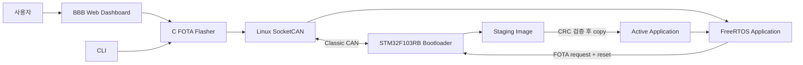
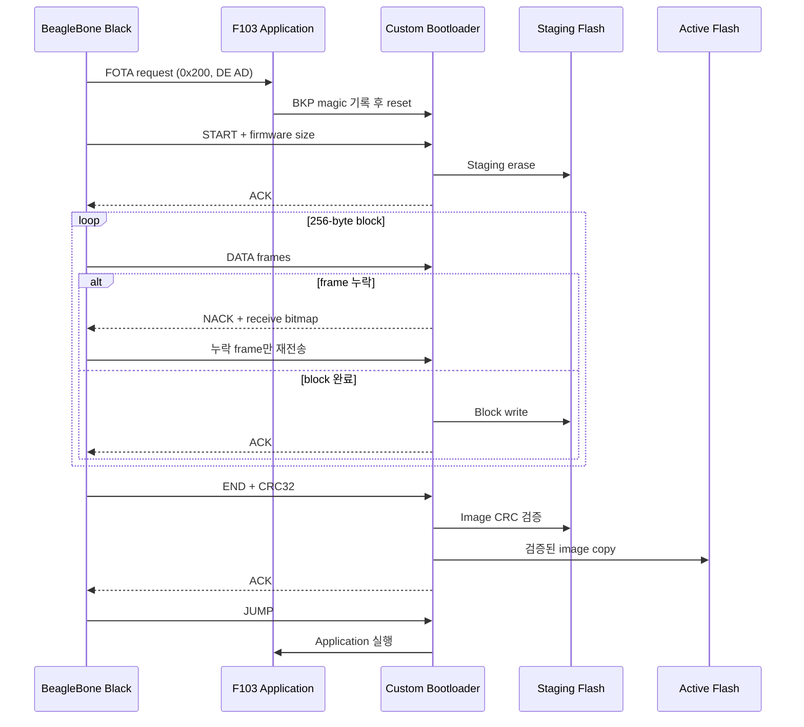

# CAN FOTA for STM32 & BeagleBone Black

STM32F103RB의 firmware를 BeagleBone Black에서 Classic CAN으로 갱신하는 staging 기반 Custom FOTA 시스템입니다.

## 프로젝트 소개

차량 ECU의 firmware를 갱신하려면 제한된 CAN payload 안에서 대용량 image를 전송하고, packet loss와 전원 차단 상황에서도 실행 가능한 firmware를 보호해야 합니다.

이 프로젝트는 캡스톤 연구에서 ISO-TP와 Custom protocol의 성능을 비교한 뒤, 그 결과를 바탕으로 STM32F103RB 환경의 실제 FOTA 구조를 발전시킨 프로젝트입니다. 현재 `main`은 성능 실험용 구현이 아니라 다음 요소를 포함하는 **F103 Custom CAN FOTA 기준 구현**입니다.

- 16 KiB CAN bootloader
- Active application과 staging 영역 분리
- Selective NACK 기반 누락 frame 재전송
- CRC32 검증 후 application 반영
- Copy 중단을 고려한 vector-last write와 자동 복구
- FreeRTOS application과 `ECU_READY` 상태 신호
- BBB SocketCAN flasher와 web dashboard

## 연구에서 구현으로

이 repository에는 두 단계의 개발 흐름이 있습니다.

| 구분 | 목적 | 주요 내용 |
| --- | --- | --- |
| `capston-1` | Protocol 비교 연구 | ISO-TP와 Selective NACK 방식의 전송 시간·재전송 특성 비교, F407/F103 성능 실험 |
| `main` | F103 FOTA 시스템 구현 | Staging, CRC 검증, 복구 전략, FreeRTOS application, BBB gateway 통합 |

발표자료의 F103 64 KiB 결과는 staging 도입 전의 64 KiB direct-write 구성에서 측정한 값입니다. 이후 memory layout을 16 KiB bootloader와 두 개의 약 56 KiB 영역으로 재설계하면서 현재 Custom firmware 한도는 **57,336 B**가 됐습니다.

캡스톤 연구 자료는 [`capston-1` branch](https://github.com/Wh31028/CanBootloader/tree/capston-1)와 [발표자료](reference/capstone-presentation.pptx)에서 확인할 수 있습니다.

## 시스템 아키텍처



BBB는 firmware 전달과 protocol 진행을 담당하고, STM32 bootloader는 Flash erase/write, CRC 검증, application 교체와 복구를 담당합니다. 상세 구조는 [시스템 아키텍처](docs/architecture.md)에 정리했습니다.

## 핵심 설계

### Selective NACK

Firmware를 256-byte block으로 나누고, 각 block을 최대 37개의 CAN frame으로 전송합니다. Target은 56-bit receive bitmap을 관리하며 누락된 sequence만 NACK으로 알려줍니다. BBB는 block 전체가 아니라 누락 frame만 다시 보냅니다.

### Staging 기반 update

새 firmware는 active application에 바로 기록되지 않습니다. 먼저 staging 영역에 수신하고 전체 CRC32가 일치한 경우에만 active 영역으로 복사합니다. 전송이나 CRC 검증이 실패하면 기존 application은 변경되지 않습니다.

### 복구 가능한 copy 순서

Application의 Initial SP와 Reset Vector가 있는 첫 8 bytes를 마지막에 기록합니다. Copy 도중 reset되어 active image가 유효하지 않으면, bootloader가 staging metadata와 CRC를 확인해 복사를 다시 시도합니다.

### Application 상태 연동

현재 application은 하나의 static FreeRTOS `AppTask`에서 CAN request와 application logic을 처리합니다. `ECU_READY` 신호는 application task가 실제로 실행 중인지를 BBB가 별도로 관찰할 수 있게 합니다.

## FOTA 동작 흐름



## 기술 스택

| 영역 | 기술 |
| --- | --- |
| Target | STM32F103RB, bxCAN, STM32F1 HAL/CMSIS |
| Application | C, FreeRTOS, static task allocation |
| Bootloader | C, Custom CAN protocol, Flash staging, IEEE CRC-32 |
| Gateway | BeagleBone Black, Linux, SocketCAN, POSIX C |
| Dashboard | Python, FastAPI, WebSocket |
| Build | CMake, Ninja, GNU Arm Embedded Toolchain, Make |

## Repository 구성

```text
.
├── boot_can_custom_f103/   # 현재 기준 Custom CAN bootloader
├── boot_can_fw_f103/       # FreeRTOS application
├── boot_can_isotp_f103/    # ISO-TP 비교 구현
├── can-fota-BBB/           # BBB flasher와 web dashboard
├── docs/                   # 설계 및 개발 과정 문서
└── reference/              # 캡스톤 발표자료
```

F407 실험 구현과 benchmark script/CSV는 연구 목적의 `capston-1` branch에 보존하고, 현재 `main`에서는 F103 구현에 집중합니다. Yocto layer와 image 구성은 별도 repository에서 관리합니다.

## Custom CAN과 ISO-TP

| 항목 | Custom CAN | ISO-TP 비교 구현 |
| --- | --- | --- |
| 목적 | 현재 F103 FOTA 기준 | 캡스톤 비교 및 reference 구현 |
| 전송 복구 | Bitmap 기반 누락 frame 선택 재전송 | Timeout 시 256-byte chunk 전체 재전송 |
| Flash 전략 | Staging 검증 후 active copy | Active 영역 direct-write |
| Application protocol | Project-specific command | ISO-TP transport 위의 project-specific command |
| 현재 위치 | `boot_can_custom_f103` | `boot_can_isotp_f103` |

ISO-TP 구현은 UDS가 아니라 ISO-TP transport 위에 자체 START/DATA/END/JUMP command를 정의한 비교 구현입니다.

## 검증 결과

| 범위 | 결과 | 근거 |
| --- | --- | --- |
| 캡스톤 protocol 비교 | F407/F103에서 loss rate와 firmware size 조건별 Custom/ISO-TP 비교 수행 | `capston-1`의 test script, CSV, graph와 발표자료 |
| F103 Custom 기준선 | 실제 board에서 FOTA와 전송 중단 후 기존 application boot 확인 | [F103 Custom FOTA 기준선](docs/f103-fota-baseline.md) |
| FreeRTOS application | Scheduler, LED, CAN FOTA entry, `ECU_READY` 동작 확인 | [FreeRTOS application 확장](docs/f103-freertos-application.md) |
| 현재 source build | Custom bootloader와 application build 성공 | GNU Arm 15.2.1 기준, hardware 재시험은 수행하지 않음 |

발표 성능 수치는 당시 direct-write 시험 구성의 결과이며 현재 staging layout의 성능 수치로 사용하지 않습니다.

## 현재 구현 범위

- Custom firmware 최대 크기는 57,336 B입니다.
- 하나의 physical Flash를 active/staging으로 나눈 구조이며 true dual-bank/A/B update는 아닙니다.
- CRC32는 전송 오류를 검출하지만 firmware의 발행자를 인증하지는 않습니다.
- BBB dashboard는 FOTA 시연과 진행 상태 관찰을 위한 prototype입니다.
- ISO-TP와 Custom protocol은 동일한 application command 표준을 구현한 것이 아니라 서로 다른 비교 경로입니다.

## 문서

- [시스템 아키텍처와 FOTA 설계](docs/architecture.md)
- [Custom CAN Protocol](docs/protocol.md)
- [STM32F103RB Memory Map](docs/memory-map.md)
- [F103 Custom FOTA 기준선](docs/f103-fota-baseline.md)
- [FreeRTOS Application 확장](docs/f103-freertos-application.md)

## 데모 자료

- [캡스톤 발표자료](reference/capstone-presentation.pptx)
- [BBB Web Dashboard](can-fota-BBB/web_dashboard/)
