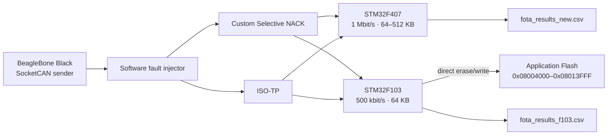

# CAN FOTA Protocol Benchmark

STM32 기반 CAN FOTA에서 ISO-TP와 Custom Selective NACK 전송 방식을 같은 direct-write Flash 조건으로 비교한 캡스톤 실험 저장소입니다.

## 연구 배경과 질문

CAN 버스에서 firmware를 전송할 때, 표준 transport인 ISO-TP와 블록 단위 누락 frame만 재전송하는 Custom protocol은 손실 조건에서 서로 다른 비용을 갖습니다. 이 프로젝트는 **같은 Flash write 주소와 image 범위**에서 두 방식의 전송 시간·frame 수·재전송 수를 관찰합니다. 결과는 특정 조건의 benchmark이며 어느 protocol의 절대적 우위를 주장하지 않습니다.



## 공정 비교 설계

F103 비교 구성에서 Custom과 ISO-TP는 모두 application start `0x08004000`, end `0x08014000`, 최대 64 KB(65,536 bytes)를 사용합니다. 수신 data는 staging 영역이나 active-image copy를 거치지 않고 application Flash에 직접 기록됩니다. 따라서 이 브랜치는 staging, 전원 차단 recovery, active image copy를 평가하지 않습니다.

## 비교 대상

| 항목 | ISO-TP | Custom Selective NACK |
|---|---|---|
| CAN ID | `0x7E0` request, `0x7E8` response | `0x100` request, `0x101` response |
| data 전송 | ISO-TP SF/FF/CF, Flow Control | 256 B block, 7 B/frame |
| 복구 | block ACK 미수신 시 block 재시도 | 수신 bitmap NACK으로 누락 sequence 재전송 |
| 종료 | END CRC 확인 후 JUMP | END CRC 확인 후 JUMP |

상세 packet 흐름은 [protocol-comparison](docs/protocol-comparison.md)을 참고하세요.

## Hardware / software stack

- STM32F407VGT6: 1 Mbit/s, 64/128/256/512 KB 확장 실험
- STM32F103RBT6: 500 kbit/s, 64 KB 저사양 MCU 실험
- BeagleBone Black: Linux SocketCAN sender 및 결과 CSV 기록
- STM32 HAL/CMSIS, CMake, Python SocketCAN script

## F103과 F407 실험 구분

F407 실험은 `fota_results_new.csv`를 기준으로 1 Mbit/s, 64/128/256/512 KB, CSV loss-rate 0/0.01/0.05/0.1%의 각 조건을 30회 반복했습니다. F103 실험은 `_f103` script와 `fota_results_f103.csv`를 기준으로 500 kbit/s, 64 KB에서 같은 네 loss-rate 구간을 각 30회 반복했습니다. MCU, bitrate와 image size가 다르므로 두 CSV의 절대 시간은 별도 표로 해석합니다.

## 결과 해석

F407에서 firmware size와 loss-rate가 커질수록 ISO-TP의 block retry 비용이 더 뚜렷하게 나타났고, 발표자료의 그래프 요약은 `fota_results_new.csv`의 평균과 일치합니다. F103에서는 64 KB의 절대 전송 시간이 F407보다 길어졌지만, 두 protocol의 시간 차이는 수 초 이내였습니다. 이는 각 script, CAN 설정, firmware 및 측정 환경의 관측값이며 다른 환경에 일반화하지 않습니다.

## 알려진 한계

- F103 ISO-TP bootloader는 현재 16 KB bootloader linker 범위를 초과해 빌드되지 않습니다. 따라서 이 branch의 ISO-TP source와 기록된 benchmark artifact를 동일한 실행 가능 binary라고 단정하지 않습니다.
- packet loss는 sender script가 주입하는 실험 조건이며 실제 차량 CAN 환경을 대표하지 않습니다.
- authentication, firmware signature, anti-rollback, 전원 차단 recovery 및 production-grade reliability는 이 benchmark 범위에 포함되지 않습니다.

## 디렉터리

```text
boot_can_custom/        Custom Selective NACK F407 bootloader
boot_can_isotp/         ISO-TP F407 bootloader
boot_can_fw/            F407 application
boot_can_custom_f103/   Custom Selective NACK F103 bootloader
boot_can_isotp_f103/    ISO-TP F103 bootloader
boot_can_fw_f103/       F103 application
can-fota-BBB/           F407/F103 SocketCAN sender, test script, CSV result
docs/                   공개 포트폴리오 문서
reference/              발표자료 (사용자 제공, Git untracked)
```

## 문서와 발표자료

- [Benchmark study](docs/benchmark-study.md)
- [Protocol comparison](docs/protocol-comparison.md)
- [STM32F407 benchmark](docs/f407-benchmark.md)
- 발표자료: [`reference/capstone-presentation.pptx`](reference/capstone-presentation.pptx)

## 팀원 및 역할

| 이름 | 역할 |
|---|---|
|  |  |
