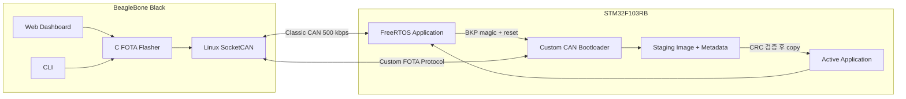
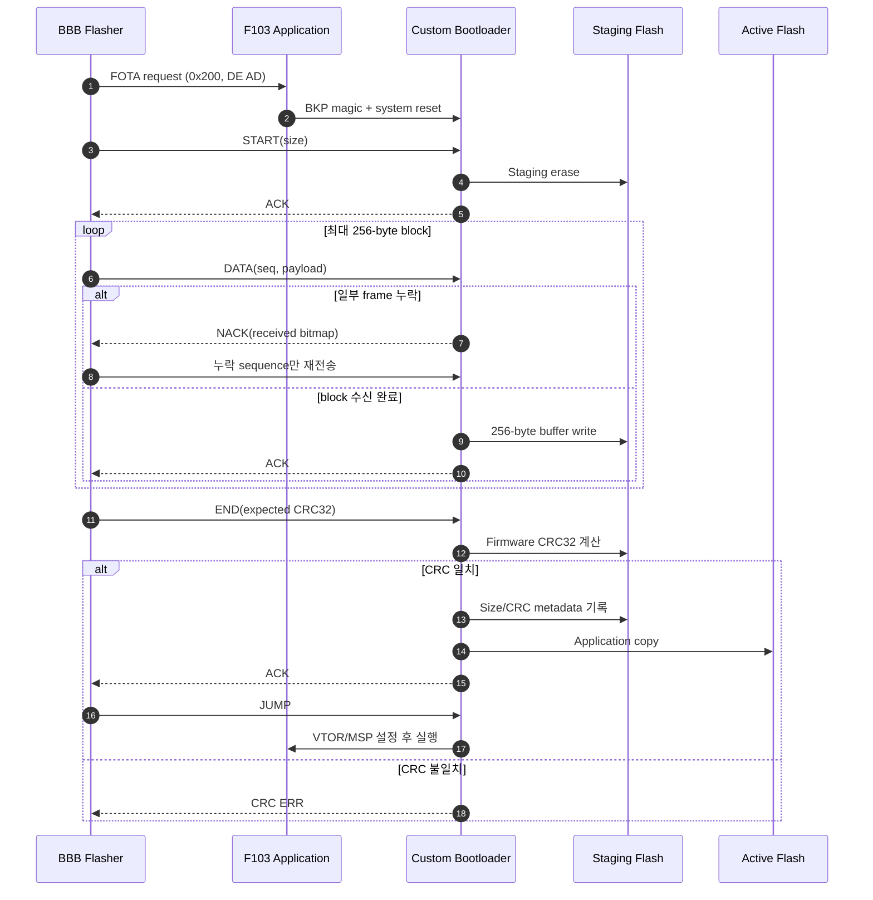
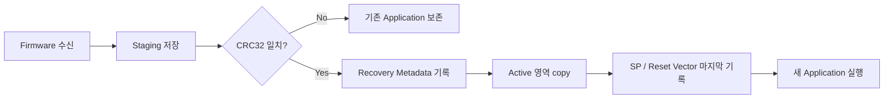

# 시스템 아키텍처와 FOTA 설계

## 설계 목표

현재 `main`은 STM32F103RB와 BeagleBone Black을 이용한 Custom CAN FOTA 시스템입니다. 캡스톤 단계에서 수행한 ISO-TP/Selective NACK 비교를 바탕으로, 제한된 128 KiB Flash 안에서 실행 image를 보호하고 update 중단 후 복구할 수 있는 구조로 발전시켰습니다.

설계의 핵심 목표는 다음과 같습니다.

- Classic CAN의 8-byte payload 안에서 firmware를 효율적으로 전송
- 누락된 frame만 다시 보내 불필요한 재전송 감소
- 전송과 CRC 검증이 끝나기 전까지 기존 application 보존
- Active copy 중 reset되어도 staging image를 이용해 복구
- BBB gateway, bootloader, application의 역할을 분리

## 전체 아키텍처

## 구성요소 역할

| 구성요소 | 역할 |
| --- | --- |
| BBB C flasher | Firmware file을 읽고 FOTA entry, START, DATA, END, JUMP 흐름을 수행합니다. |
| FastAPI dashboard | Firmware upload, FOTA 실행, 진행률과 CAN frame 시각화를 제공합니다. |
| F103 application | 평상시 ECU application을 실행하고 CAN FOTA request를 받으면 bootloader로 전환합니다. |
| Custom bootloader | Firmware 수신, Selective NACK, staging write, CRC 검증, active copy와 jump를 담당합니다. |
| Staging 영역 | 검증 전 firmware와 recovery metadata를 보관합니다. |

## Application에서 bootloader로 전환

평상시 reset에서는 bootloader가 active application의 Reset Handler를 확인한 후 `0x08004000`의 application으로 이동합니다.

BBB가 CAN ID `0x200`, payload `DE AD`를 전송하면 application은 다음 순서로 FOTA mode를 요청합니다.

1. `ECU_READY`를 Low로 전환합니다.
2. BKP DR1/DR2에 `0xDEADBEEF`를 기록합니다.
3. `NVIC_SystemReset()`을 호출합니다.
4. Bootloader가 magic을 확인하고 지운 뒤 FOTA mode에 진입합니다.

PC13 User Button을 이용한 강제 bootloader 진입 경로도 유지합니다. FOTA request 없이 valid application이 있으면 application으로 바로 jump합니다.

## Custom CAN FOTA 흐름

## Selective NACK 설계

Custom protocol은 firmware를 최대 256-byte block으로 처리합니다. 한 CAN frame은 1-byte header와 최대 7-byte firmware payload로 구성되므로 full block은 37개 frame이 됩니다.

Target은 각 block마다 receive bitmap을 관리합니다.

- Bit `1`: 해당 sequence 수신 완료
- Bit `0`: 해당 sequence 누락

마지막 expected sequence가 도착했을 때 bitmap이 완성되지 않았으면 target이 bitmap NACK을 전송합니다. BBB는 0으로 표시된 sequence만 다시 보냅니다. 캡스톤 연구에서는 이 방식과 ISO-TP의 chunk 전체 재전송을 비교했습니다.

## Staging과 복구 전략

현재 Custom FOTA는 새 image를 active application에 직접 기록하지 않습니다.

Active copy는 application의 offset 256 이후를 먼저 복사하고, 첫 block의 offset 8 이후를 복사한 뒤 Initial SP와 Reset Vector 8 bytes를 마지막에 기록합니다.

Copy 도중 reset되어 active Reset Handler가 유효하지 않으면 bootloader가 staging metadata와 CRC를 확인하고 전체 copy를 다시 시도합니다. 이 방식은 중단 복구 가능성을 높이지만, 별도 physical bank를 전환하는 true A/B update는 아닙니다.

## Boot decision과 failure handling

| 상황 | 동작 |
| --- | --- |
| 일반 reset + valid application | Application으로 jump |
| BKP FOTA magic | Custom FOTA mode 진입 |
| PC13 강제 진입 | Application 상태와 무관하게 FOTA mode 진입 |
| Invalid application + valid staging metadata | Staging CRC 확인 후 application 재복사 |
| Invalid application + invalid staging | Bootloader에 머물러 새 firmware 대기 |
| Download/CRC 실패 | Active application을 변경하지 않음 |
| Magic 진입 후 10초 무수신 | 기존 application이 valid하면 application으로 복귀 |

## 캡스톤 연구와 현재 구조

캡스톤 연구의 질문은 “packet loss가 있는 CAN 환경에서 Selective NACK 방식이 ISO-TP 기반 chunk 재전송보다 효율적인가?”였습니다.

F103 64 KiB 성능 시험 당시에는 application과 update image를 `0x08010000`부터 64 KiB로 사용하는 direct-write 구성이었습니다. 이후 `31e0002` commit에서 다음과 같이 구조가 변경됐습니다.

| 초기 성능 시험 | 현재 `main` |
| --- | --- |
| Application `0x08010000` | Application `0x08004000` |
| 64 KiB direct-write | 57,336 B staging 후 copy |
| 전송 성능 비교 중심 | 기존 image 보호와 복구 중심 |
| 실험용 F407/F103 구성 | STM32F103RB 기준 구현 |

`capston-1` tip에는 staging 전환 이후 source와 이전 64 KiB benchmark script/CSV가 함께 남아 있습니다. 따라서 발표의 성능 수치는 당시 direct-write 시험 환경의 결과로 해석하고, 현재 staging 구조의 성능으로 사용하지 않습니다.

## 현재 구현의 경계

- F103 Custom image 최대 크기는 57,336 B입니다.
- CRC32는 전송 오류 검출 기능이며 firmware origin 인증 기능은 아닙니다.
- Single Flash 내부의 staging/copy 구조로, atomic A/B slot 전환은 지원하지 않습니다.
- Custom protocol은 block identifier가 없어 ACK 유실이나 stale frame에 대한 session-level 복구가 제한적입니다.
- Dashboard는 system integration과 시연을 위한 prototype입니다.

## 관련 문서

- [Custom CAN Protocol](protocol.md)
- [STM32F103RB Memory Map](memory-map.md)
- [F103 Custom FOTA 기준선](f103-fota-baseline.md)
- [FreeRTOS Application 확장](f103-freertos-application.md)
