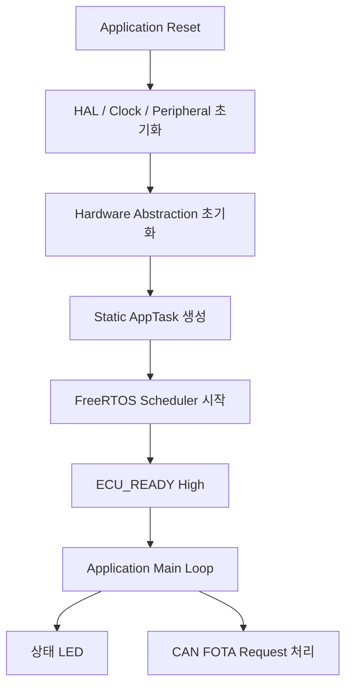

# STM32F103RB FreeRTOS Application 확장

## 확장 목표

F103 Custom FOTA 기준선을 확립한 뒤, application을 FreeRTOS 기반 구조로 확장했습니다. 이 단계의 목표는 FOTA protocol과 Flash layout을 변경하지 않으면서 application 실행 구조를 task 기반으로 전환하는 것이었습니다.

Bootloader는 bare-metal 구조를 유지하고, FreeRTOS는 `boot_can_fw_f103` application에만 적용했습니다.

## Application 구조

Application logic은 하나의 `AppTask`에서 실행합니다.

- Static task allocation만 사용
- Application task와 Idle task의 stack/TCB를 정적으로 할당
- Dynamic FreeRTOS heap 사용하지 않음
- CAN RX interrupt는 기존 ring buffer에 frame 저장
- `AppTask`가 1 ms 주기로 buffer polling
- 기존 `0x200#DEAD` FOTA entry와 bootloader compatibility 유지

## FreeRTOS 구성

| 항목 | 구성 |
| --- | --- |
| Kernel | FreeRTOS V10.3.1 |
| CPU port | GCC ARM_CM3 |
| Application task | Static `AppTask`, 256 words |
| Idle task | Static allocation |
| Tick | 1 kHz SysTick |
| Dynamic allocation | 비활성화 |
| Software timer | 비활성화 |
| Stack overflow check | `configCHECK_FOR_STACK_OVERFLOW=2` |

STM32 HAL과 FreeRTOS가 하나의 1 kHz SysTick을 공유합니다. Scheduler 시작 전에는 HAL tick만 증가시키고, scheduler 시작 후에는 HAL tick과 FreeRTOS tick handler를 함께 호출합니다.

이 설계는 별도 timer peripheral을 추가하지 않고 기존 `HAL_GetTick()` 및 application timing과 RTOS scheduler를 함께 유지합니다.

## Memory 사용 변화

FreeRTOS 적용 후 기록한 Release image 결과입니다.

| 항목 | 결과 |
| --- | ---: |
| Application BIN / Flash | 10,092 B / 57,336 B |
| RAM | 5,304 B / 20,480 B |
| Flash headroom | 47,244 B |
| RAM headroom | 15,176 B |
| AppTask stack | 1,024 B |
| Idle task stack | 512 B |
| FreeRTOS heap | 0 B |
| Vector table | `0x08004000` |

Pre-FreeRTOS 기준선보다 RAM 사용량은 1,888 B 증가했습니다. 증가분의 대부분은 application/idle task stack과 static TCB입니다.

Hardware 시험에서 `AppTask` stack high-water mark의 최소 잔여값은 224 words였습니다. 256-word stack 중 관측된 최대 사용량은 32 words(128 B)였습니다.

## ECU_READY 상태 신호

FOTA가 완료됐다는 ACK와 새 application이 실제로 scheduler까지 실행됐다는 사실은 서로 다릅니다. 이를 구분하기 위해 application 상태를 나타내는 `ECU_READY` level signal을 추가했습니다.

| STM32 상태 | `ECU_READY` |
| --- | --- |
| Reset / bootloader / FOTA 진행 | Low |
| Scheduler 시작 전 | Low |
| `AppTask` 진입 | High |
| FOTA request 처리 직전 | Low |

`ECU_READY`는 heartbeat나 firmware version protocol이 아니라, application task가 실행 상태에 도달했는지를 gateway가 관찰하기 위한 보조 신호입니다.

## FOTA compatibility 유지

FreeRTOS 도입 후에도 FOTA entry 경로는 유지됩니다.

1. `AppTask`가 CAN ring buffer에서 ID `0x200`, payload `DE AD`를 확인합니다.
2. `ECU_READY`를 Low로 전환합니다.
3. BKP DR1/DR2에 `0xDEADBEEF`를 기록합니다.
4. 100 ms 대기 후 `NVIC_SystemReset()`을 호출합니다.
5. 기존 Custom bootloader가 동일한 magic을 읽고 FOTA mode에 진입합니다.

Application execution model만 바뀌었으며 Custom packet layout, staging address, CRC와 copy flow는 변경하지 않았습니다.

## 검증 결과

- FreeRTOS scheduler와 static `AppTask` 시작 확인
- Application LED 1초 주기 동작 확인
- CAN `0x200#DEAD`를 통한 Custom bootloader 진입 확인
- FreeRTOS application image의 Custom FOTA update 확인
- 전송 중단 후 기존 application boot 확인
- Reset/bootloader/FOTA 구간의 `ECU_READY` Low 확인
- `AppTask` 진입 후 `ECU_READY` High 확인

이 검증은 STM32F103RB hardware에서 수행한 개발 기록입니다. 자동화된 CAN trace나 test report는 repository에 포함되어 있지 않습니다.

## 설계 결과

이 확장을 통해 bootloader와 application의 책임을 분리하면서도 기존 Custom FOTA compatibility를 유지했습니다. Bootloader는 작은 bare-metal recovery component로 남고, application은 향후 여러 ECU 기능을 task 단위로 확장할 수 있는 기반을 갖게 됐습니다.

## 관련 문서

- [시스템 아키텍처](architecture.md)
- [F103 Custom FOTA 기준선](f103-fota-baseline.md)
- [Custom CAN Protocol](protocol.md)
- [Memory Map](memory-map.md)
