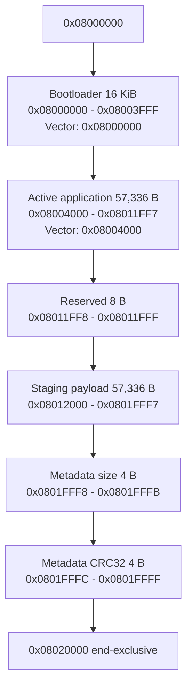
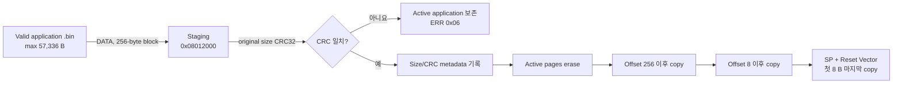

# STM32F103RB FOTA Memory Map

## 현재 Custom CAN 기준

STM32F103RB의 128 KiB internal Flash 한 개를 bootloader, active application, staging으로 나눕니다. 아래 표는 inclusive address를 사용하고, end-exclusive 경계가 필요한 곳은 따로 표시합니다.

| 영역 | 시작 | 끝(inclusive) | 크기 | 용도 |
| --- | ---: | ---: | ---: | --- |
| Bootloader | `0x08000000` | `0x08003FFF` | 16,384 B / 16 KiB | Custom bootloader와 vector table |
| Active application payload | `0x08004000` | `0x08011FF7` | 57,336 B | 현재 `boot_can_fw_f103` linker 영역 |
| Active reserved gap | `0x08011FF8` | `0x08011FFF` | 8 B | Application linker에서 제외된 공간 |
| Staging payload | `0x08012000` | `0x0801FFF7` | 57,336 B | 수신 firmware의 logical payload 범위 |
| Metadata: firmware size | `0x0801FFF8` | `0x0801FFFB` | 4 B | Auto-recovery용 little-endian size |
| Metadata: CRC32 | `0x0801FFFC` | `0x0801FFFF` | 4 B | Staging image CRC32 |
| Physical Flash end | `0x08020000` | — | end-exclusive | 이 주소에는 write할 수 없음 |



## Linker와 source 상수

### Bootloader

`boot_can_custom_f103/STM32F103XX_FLASH.ld`:

```text
FLASH ORIGIN = 0x08000000
FLASH LENGTH = 16K
```

Bootloader vector table은 `0x08000000`에 있어야 합니다.

### Application

`boot_can_fw_f103/STM32F103XX_FLASH.ld`:

```text
FLASH ORIGIN = 0x08004000
FLASH LENGTH = 56K - 8
```

따라서 application link capacity는 다음과 같습니다.

```text
(56 × 1024) - 8 = 57,336 bytes = 0xDFF8 bytes
```

Application vector table은 `0x08004000`에 있고, runtime에서 `SCB->VTOR`도 이 주소로 전환합니다.

### Custom staging

`boot_can_custom_f103/App/hw/hw_def.h`의 주요 값:

```text
FLASH_ADDR_START      = 0x08004000
FLASH_ADDR_DOWN       = 0x08012000
FLASH_ADDR_END        = 0x08020000
FLASH_ADDR_FW_MAX_LEN = (56 × 1024) - 8 = 57,336
FLASH_ADDR_META_SIZE  = 0x0801FFF8
FLASH_ADDR_META_CRC   = 0x0801FFFC
```

F103 Flash erase page는 code에서 1 KiB로 취급합니다. START는 staging의 56 KiB 전체를 erase합니다. DATA path는 마지막 partial block도 `0xFF` padding을 포함해 256 bytes를 쓰므로 최대-size image의 마지막 write는 metadata 위치까지 닿습니다. END가 CRC 성공 후 마지막 8 bytes에 size/CRC를 다시 기록합니다.

## Download와 active copy



첫 8 bytes를 마지막에 쓰는 이유는 복사 중 reset된 application을 valid로 오인해 jump하는 가능성을 줄이기 위해서입니다. 다음 boot에서 active Reset Handler가 invalid하면 staging metadata와 CRC를 검증하고 전체 copy를 다시 실행합니다.

이 방식이 보장하지 않는 것:

- 물리적으로 독립된 Flash bank 전환
- 두 개의 완전한 application slot 유지
- Atomic slot swap 또는 version rollback
- Staging corruption 시 이전 image 자동 복원
- Active copy 완료 후 active 영역 전체 CRC 재검증

따라서 code/log의 “Dual-Bank” 표현은 실제 STM32 dual-bank/A/B 구조가 아니라 staging 후 copy를 뜻하는 표현으로 해석해야 합니다.

## Firmware size와 alignment 제약

- Custom host가 보내야 할 F103 `.bin`은 valid vector table을 포함하고 57,336 B 이하여야 합니다.
- Flash driver의 `flashWrite()`는 length가 4의 배수가 아니면 실패합니다.
- Staging DATA write는 256-byte 고정이라 정렬되지만 active copy의 마지막 write는 original size에 좌우됩니다.
- Current BBB host는 57,336 B 상한과 4-byte alignment를 실행 전에 검증하지 않습니다.
- Linker가 만든 현재 application binary는 통상 word-aligned이지만, 임의 파일을 보내도 안전하다는 뜻은 아닙니다.

Size가 0이거나 상한을 초과할 때 bootloader가 START를 명시적으로 reject하지 않으므로, 현재 memory safety는 정상적인 F103 application image가 입력된다는 전제에 의존합니다.

## F103 ISO-TP 비교 map

`boot_can_isotp_f103`도 bootloader 자체는 같은 16 KiB입니다.

| 영역 | 선언된 주소 | 동작 |
| --- | --- | --- |
| ISO-TP bootloader | `0x08000000`–`0x08003FFF` | 16 KiB |
| ISO-TP direct-write application | `0x08004000`–`0x0801FFFF` | Bootloader code가 최대 112 KiB로 선언 |
| Staging | 없음 | START에서 active page를 직접 erase |

그러나 repository의 current F103 application linker는 Custom과 공유되는 57,336 B configuration입니다. ISO-TP bootloader의 선언상 범위와 현재 application image 범위가 다르기 때문에, 112 KiB 전체는 현재 repository 조합에서 검증된 지원 범위가 아닙니다.

## 발표자료와의 차이

발표자료의 F103 memory 그림은 16 KiB bootloader, 약 56 KiB active, 약 `56 KiB - 8 B` download, 8-byte metadata라는 방향에서 current code와 유사합니다. 반면 F103 성능 graph의 64 KiB firmware 조건은 그 staging layout 이전의 시험이다.

`capston-1`에 보존된 loss test script는 실제 application binary 뒤에 test pattern을 붙여 64 KiB로 확장해 전송한다. 해당 결과가 생성된 초기 F103 Custom source는 application을 `0x08010000`부터 64 KiB로 link하고, 같은 64 KiB를 direct-write하는 구조였다. 이후 `31e0002` commit이 staging/copy로 전환하면서 current 57,336 B limit가 생겼다. 두 memory map의 성능 결과를 직접 비교하거나 current limit에 적용하면 안 된다.

참고로 `capston-1` tip의 Custom bootloader 상수는 이미 57,336 B지만 application
linker는 56 KiB(57,344 B)이고, 64 KiB padding test script/CSV는 남아 있다. 따라서
branch tip의 source와 64 KiB 결과를 같은 실행 configuration으로 보지 않는다.

## 관련 문서

- [시스템 아키텍처](architecture.md)
- [Protocol 명세](protocol.md)
- [F103 Custom FOTA 기준선](f103-fota-baseline.md)
