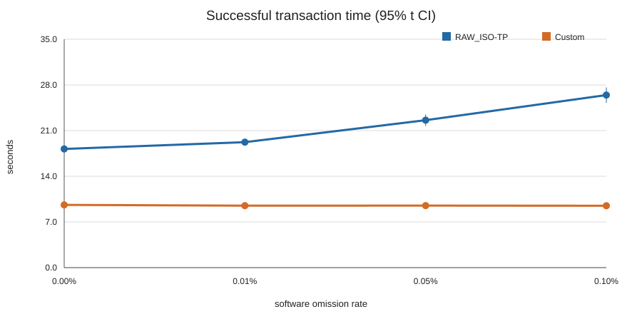
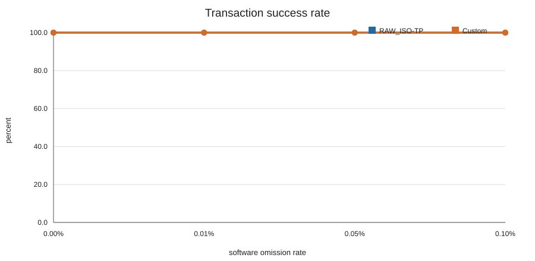
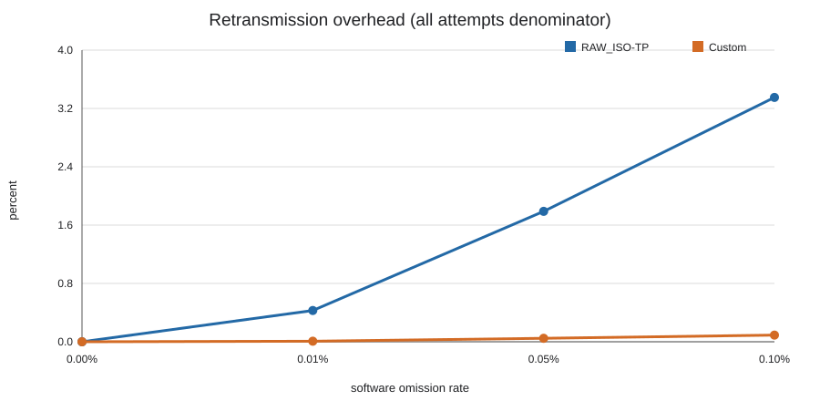

# P05 — P04 본 dataset 분석과 1페이지 요약문 초안

## 상태

- Task: **DONE (내용 초안)**
- 작업 날짜: 2026-10-09
- branch / 시작 HEAD: `paper/ksma-2026` / `c1d1e21c31c59eb1c436a7b6f587bcbba6e59a5e`
- 범위: P04의 유효 본 dataset 분석과 Markdown 요약문 갱신만 수행했다. F103, `main`의 TW-03, hardware 재실행, 외부 제출·연락은 실행하지 않았다.
- 공식 1페이지 양식·저자·소속·제출 트랙이 아직 없으므로 [요약문](../../paper/abstract.md)은 **제출본이 아닌 내용 초안**이다. 양식 적용과 제출은 다음 Task의 외부 blocker다.

## 입력 범위와 보존

분석 입력은 아래 두 P04 run으로 제한했다.

| protocol | 유효 run | raw 결과 |
| --- | --- | --- |
| RAW_ISO-TP | `isotp-120-entry-v1` | 120 `OK` |
| Custom | `custom-120-terminal-probe-v1` | 120 `OK` |

초기 runner/dependency/CAN 무응답 artifact와 보정 전 `custom-120-entry-v1`/`custom-120-entry-v2`는 삭제하거나 유효 240 trial에 합치지 않았다. `custom-120-entry-v2`의 110 `OK`/10 `FAIL_DATA_TIMEOUT`은 terminal-frame probe 결함을 보인 별도 실패 기록으로 보존된다.

두 유효 run은 각각 CSV 120행, JSONL 120행, manifest trial 120개다. 모든 manifest trial은 `EXITED`, exit code 0이며 raw 결과도 모두 `OK`다.

## 재생성과 검증

재생성 script와 출력은 [experiments/ksma-2026/analysis](../../../experiments/ksma-2026/analysis/)에 있다.

```powershell
python experiments/ksma-2026/analysis/p05_analyze.py `
  --input-root docs/paper-plan/reports/artifacts/P04-20261009/bbb-p04-f407-500k-20261009 `
  --output experiments/ksma-2026/analysis/p05-terminal-probe-v1-20261009
```

실행 결과: **PASS** — 승인된 240 trial만 검사·집계했다. script는 P02 schema, 중복 trial ID, CSV/JSONL/manifest correspondence, 계획한 protocol/loss/seed, firmware hash 혼합, `EXITED` 상태 및 raw status와 manifest exit code의 대응을 검증한다. 입력 raw hash와 source fingerprint는 [p05-validation.json](../../../experiments/ksma-2026/analysis/p05-20261009/p05-validation.json)에 기록한다.

## 방법

- F407, CAN 500 kbit/s, 동일 65,536-byte firmware SHA-256 `1badd29c53120916c2f2b0f2e773c6af953960bedeb1c199b66021096b9870e1`, FOTA `[0x08010000,0x08020000)`의 direct-write 조건이다.
- transaction 시간은 sender monotonic clock의 START 송신 직전부터 유효 END ACK 직후까지이며 erase/write/CRC를 포함한다. entry `0x200#DEAD` 후 3.0 s 대기는 측정에서 제외됐다. BBB wall-clock timestamp는 사용하지 않았다.
- 시간 통계는 `OK` 행만의 표본 평균, sample SD, 양측 95% Student-t CI(`mean ± t_(0.975,n-1) × SD/sqrt(n)`)다. 이는 이 30회 조건 내 성공 transaction의 불확실성이며 다른 seed/host/물리 오류 환경으로 일반화하지 않는다.
- 성공률은 모든 계획 trial, 재전송 overhead는 모든 계획 trial의 `sum(retransmit_attempts) / sum(send_attempts)`다. timeout elapsed는 성공 시간으로 대체하거나 평균에 넣지 않았다.

## 결과

아래 수치는 [요약 CSV](../../../experiments/ksma-2026/analysis/p05-terminal-probe-v1-20261009/p05-summary-by-protocol-loss.csv)에서 재생성된다. 시간은 성공 조건부 초 단위다.

| protocol | loss | 시도 / OK / 실패 | 성공률 | 성공 시간 평균 ± SD (95% CI), n | 재전송 / 전체 시도 | overhead |
| --- | ---: | ---: | ---: | ---: | ---: | ---: |
| RAW_ISO-TP | 0% | 30 / 30 / 0 | 100.0% | 18.193 ± 0.120 (18.148–18.238), 30 | 0 / 284,220 | 0.000% |
| RAW_ISO-TP | 0.01% | 30 / 30 / 0 | 100.0% | 19.227 ± 0.968 (18.866–19.589), 30 | 1,221 / 284,869 | 0.429% |
| RAW_ISO-TP | 0.05% | 30 / 30 / 0 | 100.0% | 22.594 ± 2.363 (21.711–23.477), 30 | 5,141 / 287,361 | 1.789% |
| RAW_ISO-TP | 0.1% | 30 / 30 / 0 | 100.0% | 26.448 ± 3.138 (25.276–27.620), 30 | 9,735 / 290,511 | 3.351% |
| Custom | 0% | 30 / 30 / 0 | 100.0% | 9.617 ± 0.277 (9.514–9.720), 30 | 0 / 284,220 | 0.000% |
| Custom | 0.01% | 30 / 30 / 0 | 100.0% | 9.496 ± 0.133 (9.446–9.546), 30 | 20 / 284,240 | 0.007% |
| Custom | 0.05% | 30 / 30 / 0 | 100.0% | 9.510 ± 0.127 (9.462–9.557), 30 | 136 / 284,356 | 0.048% |
| Custom | 0.1% | 30 / 30 / 0 | 100.0% | 9.484 ± 0.114 (9.441–9.526), 30 | 259 / 284,479 | 0.091% |

성공한 Custom transaction의 평균 시간은 네 loss 조건에서 9.484–9.617 s, RAW_ISO-TP는 18.193–26.448 s였다. 새 유효 dataset에서는 두 방식 모두 120/120 성공했다. 0.1% 조건의 overhead는 Custom 0.091%, RAW_ISO-TP 3.351%다. 다만 보정 전 Custom 실패 10건은 별도 artifact로 보존하며, 성공 시간만으로 ISO-TP 전체나 일반 신뢰성 우위를 주장하지 않는다.







## 한계와 인수인계

- software omission은 physical CAN bit error rate 또는 차량 환경을 재현하지 않는다. 두 구현의 frame 역할과 재시도 단위가 다르므로 ISO-TP 전체의 일반적 우열을 주장하지 않는다.
- transaction `OK`는 END ACK/CRC 성공 기준이며 application boot는 별도 기록이다. P03 readback은 각 방식의 smoke에서 수행됐지만 P04 240건의 매 trial readback은 하지 않았다.
- build/hardware test는 이 문서·분석 작업에서 실행하지 않았다 (**NOT RUN**). analysis script 실행과 raw integrity validation만 PASS다.
- 다음 Task는 **P06만**이다. 공식 양식·저자 정보·교수 검토·외부 제출은 사용자 확인 전까지 미완료로 남긴다.
