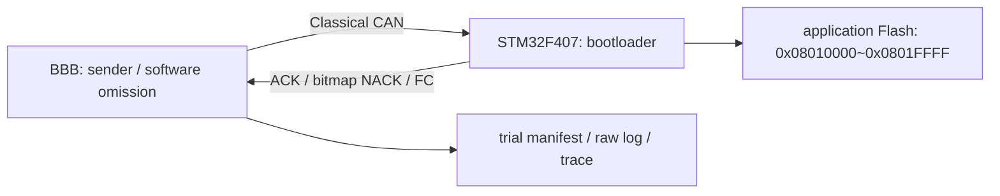

# CAN 기반 펌웨어 업데이트를 위한 비트맵 선택 재전송 기법의 구현 및 성능 평가

P00 골격 / 2026-10-05 / 2~3페이지 목표, 공식 양식 및 PDF 페이지 검증 NOT RUN.
[저자·소속·교신저자·제출 트랙 미확정]

## 1. 서론과 연구 질문

펌웨어를 여러 CAN 프레임으로 분할해 전송하는 환경에서 수신 누락을 어떻게 보고하고 어느 단위로 복구하는지 비교한다. 연구 질문은 송신단 software omission 조건에서 bitmap 선택 재전송과 ISO-TP 기반 FOTA application block 재시도의 시간·재전송량이 어떻게 다른가이다. 누락된 프레임만 다시 보내는 방식이 일부 조건에서 재전송량을 줄일 수 있다는 가설을 검증하며, 시간 이득이나 우월성을 전제하지 않는다.

실험은 capston-1 기반 direct-write branch에서 진행한다. main의 staging 구현·TW-03 자료 및 기존 예비 CSV와 데이터셋을 분리한다.

## 2. 관련 배경과 비교 대상

ISO-TP의 SF/FF/CF/FC는 CAN에서 분할 전송과 흐름 제어를 제공한다. FC의 blocksize와 STmin은 수신 측이 제시하는 전송 제약이다. [Linux 공식 ISO-TP 문서](https://docs.kernel.org/networking/iso15765-2.html)

수신한 구간을 송신 측에 알리고 누락 부분을 재전송하는 발상은 TCP SACK 등에도 나타난다. 이 원리는 배경으로만 인용하며 TCP의 성능 결과를 CAN FOTA의 근거로 대체하지 않는다. [RFC 2018](https://www.rfc-editor.org/rfc/rfc2018.html)

| 항목 | Custom bitmap | 본 프로젝트 ISO-TP 기반 FOTA |
| --- | --- | --- |
| 송신/응답 CAN ID | 0x100 / 0x101 | 0x7E0 / 0x7E8 |
| application 데이터 단위 | 256 bytes | 256 bytes + command 1 byte의 ISO-TP PDU |
| 정상 block의 데이터 운반 | 최대 7 bytes씩 37 DATA frames | FF 1 + CF 36 |
| 복구 | 수신 bitmap에서 빠진 sequence 재전송 | application ACK timeout 등에서 block 재시도 |
| 최종 확인 | image CRC32와 END 응답 | image CRC32와 END 응답 |

application block 재시도는 이 저장소의 sender 정책이다. 이를 ISO-TP 표준 자체의 필수 재전송 방식이나 일반적인 UDS 구현과 동일시하지 않는다. 256-byte application chunk를 FC BS=256이라고 쓰지 않는다. 고정 isotp-c revision의 실제 FC 기본값은 BS=8, STmin=0 ms, transport response timeout=100 ms이다. 현재 F407 sender의 BS=0 가정은 P01 수정 대상이다. 자세한 출처와 열람 범위는 [references.md](references.md)에 정리했다.

## 3. 시스템과 방법

### 3.1 공통 조건안

| 조건 | 계획 및 P00 확인 수준 |
| --- | --- |
| 보드 | STM32F407 주 후보, 실제 보드 식별·기동 미확인 |
| bitrate | source 계산 1 Mbit/s; 실제 bus는 P03 확인 |
| image | 동일 65,536 bytes와 hash, 원본 app 뒤 증가 패턴 0x00~0xFF 반복 padding |
| Flash | start 0x08010000, end exclusive 0x08020000, sector 4 erase |
| block | 256 bytes, 256 blocks |
| 실험 횟수 | 2방식 × 4확률 × 30회 = 240개의 계획 시도 |
| 확률 p | 0 / 0.0001 / 0.0005 / 0.001; 백분율 0 / 0.01 / 0.05 / 0.1% |
| transaction 성공 | CRC 성공을 나타내는 유효한 END ACK |
| boot 성공 | 별도 관측·필드, 확인 방법은 P03 확정 |
| 최적화 | P00 원형은 Custom -Os, ISO-TP 사용자 코드 -O0; P03 전 비교 정책 통일·재빌드 필요 |

P00 app binary는 36,832 bytes로 64 KiB에 들어간다. padding image와 실제 시험 hash는 아직 생성·확정하지 않았다. 정적 vector/address 검증은 hardware boot 검증을 대신하지 않는다. 초기 설정안은 [experiment-config.draft.json](experiment-config.draft.json)이며 실행 config가 아니다.

F103은 보충 후보다. bootloader 16 KiB, application [0x08004000, 0x08014000), 최대 65,536 bytes이다. ISO-TP build는 Flash overflow로 실패했고 보충 비교는 미확보이다. main의 staging 0x08012000와 57,336-byte 한도는 적용하지 않는다.

### 3.2 주입 모델

fault는 송신 socket 호출 전에 선택한 프레임을 생략하는 software omission이다. 실제 CAN bus error나 controller 자동 재전송을 주입하는 시험이 아니다. 원형은 Custom DATA 전체와 ISO-TP CF만을 대상으로 하며 FF는 제외되어 비대칭이다. Custom의 timeout tail probe는 누락 주입을 거치지 않고 선택 재전송 DATA는 다시 주입된다. ISO-TP는 재시도 block의 CF에도 주입된다.

P02에서 eligible frame 집합, FF 포함 여부, 마지막 frame·재전송 정책, seed와 drop 위치 기록을 확정한다. 같은 seed는 동일 fault schedule을 보장하지 않는다. ACK/NACK/FC loss는 기본 matrix에서 제외한다. 연속 trial의 순서는 protocol 교차 또는 균형 batch로 계획하고 실제 순서를 보존한다.

### 3.3 시간·계수·실패

monotonic clock으로 START 송신 직전부터 검증된 END ACK 직후까지 측정한다. erase/write/CRC와 호스트 처리·대기를 포함한 CAN FOTA transaction 시간이며 transport-only나 전체 ECU downtime이 아니다. download, bootloader 진입 대기, JUMP 전 0.5초 대기와 boot 확인은 제외한다.

송신 시도·software drop·socket 송신 성공·송신 오류·protocol RX·재전송 시도/성공을 구분한다. SocketCAN 송신 성공은 실제 on-wire 완료 횟수가 아니다. overhead 분모는 P01에서 고정한다. bounded retry/deadline 및 crash/timeout/중단 기록은 P02에서 구현한다. 성공만 채워 30회로 대체하지 않는다.

### 3.4 재현성과 분석 계획

각 trial에 source commit + dirty patch + 파일 hash, 두 bootloader 및 image hash, toolchain, BBB OS/interface 설정, seed, 명령과 exit status를 연결한다. 시도/성공/실패 수, 성공률, 성공 조건부 시간의 평균·표준편차·95% CI와 재전송량을 함께 제시한다. CI 방법·가정·표본 수는 P05에서 명시한다.

## 4. 결과

**[결과 미확정]**. hardware smoke 및 240회 본 실험 NOT RUN. 기존 CSV에서 수치를 옮기거나 보정하지 않는다.

- 표 1: [조건별 시도·성공·실패 수와 실패 유형]
- 그림 1: [성공 조건부 transaction 시간과 95% CI]
- 그림 2: [같은 정의의 재전송량/overhead]
- 결과 문장: [raw dataset 경로·분석 명령·표본 수를 연결해 작성]

## 5. 논의·한계와 결론

**[결과 미확정]**. 선택 재전송 이득과 추가 bitmap/처리 비용은 관측 후 평가한다. 누락 대상 비대칭, FC 준수, compiler 옵션, host 부하, bitrate, 제한된 image 크기를 해석에 포함한다. ACK loss로 인한 중복 block 처리 등은 별도 위험으로 다루며 이번 DATA-only 주입 결과로 일반적인 신뢰성을 주장하지 않는다.

서로 다른 MCU/bitrate의 절대 시간 차이를 MCU 효과로 분리하지 않는다. 차량 BER·혼합 traffic·다중 ECU·staging·rollback·signature·power-loss recovery는 검증 범위 밖이다.

## 참고문헌 및 제출 잔여

[references.md](references.md)의 열람한 원문/공식 문서만 인용한다. 제출 전 저자, 트랙, 공식 양식, 참고문헌 포함 페이지 계산, 발표 형식, deadline 확인과 사용자·교수 검토가 필요하다. 외부 제출은 사용자 진행이다.
