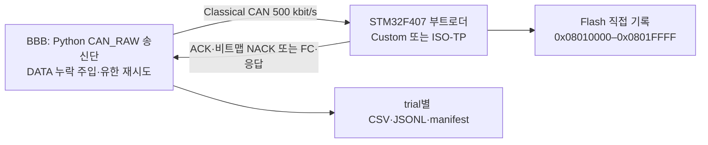

# CAN 기반 펌웨어 업데이트를 위한 비트맵 선택 재전송 기법의 구현 및 성능 평가

P08 문서·근거 검토본 / 2026-10-10 / `p08-doc-review-v1` / 2~3페이지 목표. 공식 양식 적용·PDF 페이지 검증: **NOT RUN**.

[저자·소속·교신저자·제출 트랙 미확정]

## 1. 서론 및 관련 배경

CAN(Controller Area Network) 기반 펌웨어 업데이트에서는 분할된 데이터의 누락을 알리는 방법과 재전송 단위가 복구 비용에 영향을 준다. 본 연구는 BeagleBone Black(BBB) 송신단과 STM32F407 수신단에서, 수신 비트맵으로 빠진 프레임을 식별하는 Custom 방식과 ISO-TP 기반 구현의 애플리케이션 블록 재시도를 비교한다. 연구 질문은 송신단의 소프트웨어 데이터 누락 조건에서 두 구현의 성공률, 성공 조건부 시간, 재전송량이 어떻게 달라지는가이다.

ISO-TP는 긴 메시지를 첫 프레임(FF)과 연속 프레임(CF)으로 나누며, 수신단의 흐름 제어(FC)가 연속 전송할 CF 수(BS)와 최소 간격(STmin)을 지정한다. 한 프레임으로 끝나는 메시지는 SF로 보낸다.[1] 수신 구간을 보고하여 누락 부분을 다시 보내는 원리는 TCP SACK에도 쓰이지만, 이는 선택 재전송의 배경이며 CAN에서의 성능 근거는 아니다.[2] 본 비교의 256-byte 블록 재시도는 프로젝트 송신 프로그램의 정책이다. ISO-TP 표준의 필수 복구 방식, Linux 커널 ISO-TP, 일반 UDS 구현 전체의 성능을 대표하지 않는다.

## 2. 시스템과 복구 방식

그림 1. 같은 보드에 각 부트로더를 사용한 direct-write 비교 구성. ACK는 정상 수신 응답, NACK는 누락 보고이며, Flash 기록과 최종 CRC32 검사를 포함한다.

두 방식은 65,536-byte 이미지를 256-byte 블록 256개로 처리한다. Custom은 블록을 최대 7-byte 데이터의 37개 프레임으로 나누고, 수신단은 비트맵에서 빠진 번호를 알려 선택 재전송하게 한다. 마지막 프레임이 누락되면 수신단이 비트맵 NACK를 내지 못하므로, 보정 송신단은 응답 대기 후 마지막 프레임을 최대 4회 다시 보내 응답을 유도한다(terminal-frame probe). 이 probe에도 누락 주입과 재전송 계수를 적용한다. 비트맵에 따른 선택 재전송 후에도 ACK가 없으면 실패로 끝낸다.

비교 ISO-TP 구현은 명령 1 byte와 데이터 256 bytes를 FF 1개와 CF 36개로 전송한다. 송신단은 FC의 BS=8, STmin=0을 확인하고 8 CF마다 다음 FC를 기다린다. 전송 또는 애플리케이션 응답 확인에 실패하면 해당 블록의 전송을 다시 시작하며, 최초 전송을 포함해 최대 4회 시도한다. 수신단의 고정 isotp-c 버전은 transport 응답 timeout 100 ms를 사용한다.[3] 이 설정은 송신단의 DATA 응답 대기 0.15 s 및 FC 대기 1 s와 구별된다. 두 방식의 transaction deadline 설정은 120 s, runner 제한은 140 s다.

## 3. 실험 방법과 측정 범위

표 1. P04 유효 데이터의 공통 조건.[4]

| 항목 | 실제 조건 |
| --- | --- |
| 장비·통신 | STM32F4DISCOVERY의 F407, BBB Linux 4.19.94-ti-r42, CAN 500 kbit/s |
| 이미지 | 동일 65,536 bytes, 애플리케이션 뒤 0xFF padding; SHA-256 `1badd29c…9870e1` |
| 기록 범위 | `[0x08010000,0x08020000)`, START에서 Flash sector 4 erase |
| 구현 설정 | 양 부트로더 사용자 코드 -Os; 표준 CAN ID Custom 0x100/0x101, ISO-TP 0x7e0/0x7e8 |
| 누락 확률 p | 0, 0.0001, 0.0005, 0.001 (0, 0.01, 0.05, 0.1%) |
| 반복·실행 순서 | 방식별 확률당 30회; protocol별 별도 batch, 각 batch에서 확률 오름차순 |
| 성공 판정 | raw `transaction_status=OK`; END ACK/CRC 확인과 JUMP 송신 호출 성공, 부팅 관측은 별도 |

유효 입력은 `isotp-120-entry-v1` 120회와 `custom-120-terminal-probe-v1` 120회, 총 240회다. 송신단 source fingerprint와 부트로더·이미지 hash는 각 manifest 및 P05 검증 기록으로 특정한다.[4] 두 batch는 서로 다른 송신단 revision과 seed 집합으로 실행됐다. 기존 예비 CSV, P03 smoke, 보정 전 Custom 및 초기 실행 오류 기록은 이 240회에 합치지 않았다.

누락은 socket 송신 호출 전에 해당 프레임을 생략하는 software omission이다. 모델 `p02-frame-omission-v1`은 Custom DATA 37개와 ISO-TP CF 36개를 블록별 대상으로 삼으며, 원본 및 재전송마다 seed 기반으로 추첨한다. ISO-TP FF와 START/END/JUMP, ACK/NACK/FC에는 누락을 주입하지 않는다. 따라서 같은 확률은 같은 누락 위치나 같은 노출량을 뜻하지 않는다. 이는 물리 CAN bit error rate, 오류 프레임 또는 controller 자동 재전송을 재현한 실험이 아니다.

의도한 시간 경계는 monotonic clock의 START 송신 직전부터 유효 END ACK 직후까지이며, erase/write/CRC와 호스트 처리·대기를 포함한다. 다만 **실행 source의 `elapsed_sec`는 protocol 호출 직전부터 JUMP 송신 호출 뒤까지 기록되어**, END ACK 뒤 함수 반환·JUMP 송신 처리도 포함한다. 그 추가 시간을 별도로 분리할 기록은 없어, 본문·그림에는 P05가 집계한 raw elapsed를 그대로 사용한다. 다운로드, entry `0x200#DEAD` 뒤 3.0 s 대기, 실제 부팅 확인은 포함하지 않으며, 이 실행 경로에는 과거의 JUMP 전 0.5 s 대기가 없다. 임의 시간 차감은 하지 않았다. 순수 transport 시간이나 정확한 END ACK 종료 시간, 전체 ECU 정지 시간으로 해석하지 않는다.

성공률은 모든 계획 trial을 분모로 한다. 시간은 `OK` 행만의 평균·표본 표준편차(SD) 및 양측 95% Student-t 신뢰구간(CI: 평균 ± t×SD/√n)이다. 조건별 n=30, 자유도 29를 사용하며, 독립·동일 조건 반복과 평균의 근사적 정규성을 전제한다. 이 CI는 고정된 장비·실행 순서에서 관측한 산포를 요약하며 다른 환경까지 보장하지 않는다. 실패 경과시간을 성공 시간에 대입하지 않는다.

재전송 overhead는 조건별 모든 계획 trial에서 `Σ retransmit_attempts / Σ send_attempts × 100`이다. 분모는 software drop도 포함한 START/DATA/END의 논리적 송신 시도이며, entry·JUMP 및 수신 응답은 제외된다. ENOBUFS 재호출은 별도 송신 오류로 기록하고 논리적 시도를 중복 가산하지 않는다. SocketCAN acceptance는 실제 선로 송신 완료나 CAN 자동 재전송 횟수가 아니므로, 이 비율은 총 버스 점유율을 뜻하지 않는다.

## 4. 결과와 논의

두 유효 run은 각각 120/120 `OK`이며, 여덟 조건 모두 30회 시도 중 성공 30회·실패 0회로 관측 성공률은 100%였다. 이는 제한된 표본의 결과이며 실패 확률이 0이라는 보장은 아니다. 모든 trial의 부팅 필드는 `JUMP_SENT_NOT_VERIFIED`로, 240회의 개별 애플리케이션 기동 성공을 뜻하지 않는다.

표 2. 성공 조건부 raw elapsed의 평균 ± SD(s)와 모든 송신 시도 기준 재전송 overhead(%). 각 시간 표본 n=30. 수치는 P05 summary CSV를 소수 셋째 자리로 반올림했다.[4]

| 누락 확률 | Custom 시간 | RAW_ISO-TP 시간 | Custom overhead | RAW_ISO-TP overhead |
| ---: | ---: | ---: | ---: | ---: |
| 0% | 9.617 ± 0.277 | 18.193 ± 0.120 | 0.000 | 0.000 |
| 0.01% | 9.496 ± 0.133 | 19.227 ± 0.968 | 0.007 | 0.429 |
| 0.05% | 9.510 ± 0.127 | 22.594 ± 2.363 | 0.048 | 1.789 |
| 0.1% | 9.484 ± 0.114 | 26.448 ± 3.138 | 0.091 | 3.351 |

그림 2. P05 성공 조건부 시간 SVG. 오차막대는 95% t CI다. 제목의 transaction time은 3절의 실제 측정 경계를 따른다. 확률 조건은 등간격 범주로 배치되어 연속 확률축의 기울기로 해석하지 않는다.

그림 3. P05 재전송 overhead SVG. Custom의 선택 재전송·terminal probe와 비교 구현의 블록 재시도를 센다. 수신 방향 FC·ACK 등은 이 지표에 포함되지 않는다.

RAW_ISO-TP의 평균 시간은 0%에서 18.193 s(CI 18.148–18.238), 0.1%에서 26.448 s(25.276–27.620)였다. Custom은 각각 9.617 s(9.514–9.720), 9.484 s(9.441–9.526)였다. 0.1%에서 재전송/전체 송신 시도는 Custom 259/284,479, RAW_ISO-TP 9,735/290,511이었다. 작은 재전송 단위와 관측 overhead 차이는 일관되지만, 전체 시간 차이를 선택 재전송 하나의 효과로 분리할 수는 없다. 무누락에서도 시간 차이가 있으며 FC 처리·호스트 스케줄링·프로토콜별 대기와 batch 순서가 함께 작용한다. Custom의 높은 누락 조건에서 시간이 조금 짧아진 것을 누락의 성능 개선 효과로 해석하지 않는다. Custom의 송신 오류 계수 합계 31건도 raw에 보존되어 있으며, transaction 실패 31건을 뜻하지 않는다.

보정 전 `custom-120-entry-v2`는 120회 중 110 `OK`, 10 `FAIL_DATA_TIMEOUT`(관측 성공률 91.7%)이었다. 10건 모두 블록의 최초 전송에서 마지막 `frame_index=36` 누락을 포함했고, 당시 송신단은 첫 무응답에서 실패했다. 이후 terminal-frame probe를 적용한 **별도 120회 전체 batch**가 현재 Custom 입력이다. 실패 10건만 성공으로 바꾼 자료가 아니며, 원본 실패와 성공 110건 모두 별도로 보존한다. 이 경과는 복구 정책의 구현 완전성이 결과에 영향을 줄 수 있음을 보이며, 보정 전후 batch의 성능 차이를 통제된 짝비교 효과로 단정하지 않는다.

## 5. 결론 및 한계

이 F407 direct-write 구현과 software omission 조건에서 보정 Custom은 비교 ISO-TP 기반 구현보다 짧은 성공 조건부 시간과 작은 재전송 overhead를 보였고, 유효 데이터의 관측 성공률은 두 방식 모두 120/120이었다. 그러나 누락 대상의 비대칭, 서로 다른 seed·source revision, 무작위화되지 않은 별도 batch, 시간 종료점의 JUMP 송신 포함 때문에 ISO-TP 전체에 대한 우위나 일반 신뢰성 향상으로 확대할 수 없다.

P03의 기동 관측·readback 및 P04 종료 후 readback은 개별 검증 근거이며 모든 trial의 개별 readback을 대신하지 않는다. 한 보드·한 이미지 크기·한 bitrate만 평가했고 ACK/FC 누락, burst loss, 혼합 트래픽, 다중 ECU 및 실제 차량 환경은 검증하지 않았다. F103 비교, 전원 차단 복구, staging·rollback·서명도 본 결과의 범위 밖이다. raw 수치와 성공·실패 기록을 함께 제시하는 제한된 구현 비교로 결론을 한정한다.

## 참고문헌

[1] Linux Kernel documentation, [ISO 15765-2 (ISO-TP)](https://docs.kernel.org/networking/iso15765-2.html), frame types 및 Flow Control options, 열람 2026-10-10. ISO 표준 전문을 대체하지 않음.

[2] M. Mathis et al., [TCP Selective Acknowledgment Options, RFC 2018](https://www.rfc-editor.org/rfc/rfc2018.html), 1996, §§1, 3, 5, 열람 2026-10-10.

[3] lishen2, [isotp-c, revision 5593428d95af10dde1e565cebcda16089fc74857](https://github.com/lishen2/isotp-c/tree/5593428d95af10dde1e565cebcda16089fc74857), 로컬 `isotp_config.h` 대조, 2026-10-10.

[4] 본 연구 [P03](../paper-plan/reports/P03.md)·[P04](../paper-plan/reports/P04.md)·[P05](../paper-plan/reports/P05.md) 기록, [보정 데이터 summary CSV](../../experiments/ksma-2026/analysis/p05-terminal-probe-v1-20261009/p05-summary-by-protocol-loss.csv), [입력 hash·source fingerprint](../../experiments/ksma-2026/analysis/p05-terminal-probe-v1-20261009/p05-validation.json). 보정 전 결과와 구별해 읽는다.

---

작성 메모(제출 본문 제외): 이 문서는 Markdown 내용 검토본이다. 공식 양식·저자·트랙·참고문헌 포함 페이지 수 및 교수 검토는 미완료다. [P06 보고](../paper-plan/reports/P06.md)의 시간 경계 확인을 유지하고, [P08 보고](../paper-plan/reports/P08.md)에 요약문 문구 정합화, 수치·근거 재검증, checksum과 잔여 조건을 기록했다. 성공률 그림은 지면 절약을 위해 본문 수치로 대신하며 [P05 원본 SVG](../../experiments/ksma-2026/analysis/p05-terminal-probe-v1-20261009/p05-success-rate.svg)를 보존한다.
