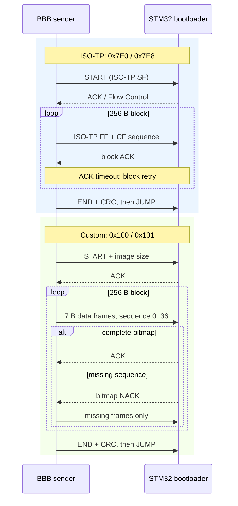

# ISO-TP와 Custom Selective NACK 비교

## 전송 흐름

## 구현 차이

| 항목 | ISO-TP | Custom Selective NACK |
|---|---|---|
| packetization | ISO-TP SF/FF/CF | 6-bit sequence을 가진 7 B payload frame |
| flow control | ISO-TP Flow Control와 sender의 block ACK 대기 | 256 B block 수신 bitmap |
| ACK/NACK | START/DATA/END command ACK, timeout 시 block 재시도 | block complete ACK 또는 56-bit bitmap NACK |
| sequence | ISO-TP consecutive-frame sequence | frame sequence `0..36` |
| retry | ACK를 받지 못한 256 B block 재전송 | NACK bitmap이 가리킨 누락 frame 재전송 |

## Custom Selective NACK의 의도와 trade-off

Custom protocol은 한 block의 수신 상태를 bitmap으로 보낸 뒤, sender가 빠진 sequence만 다시 보내게 설계되었습니다. 손실이 드문 block에서는 전송량을 줄일 수 있습니다. 반면 protocol-specific framing, bitmap 해석, sender/bootloader 상태 일치가 필요하며, timeout이나 마지막 frame 유실 처리도 benchmark 결과에 영향을 줍니다.

## ISO-TP 표준 transport의 장점

ISO-TP는 multi-frame CAN transport를 위한 널리 알려진 framing과 Flow Control 모델을 제공합니다. 기존 ISO-TP tooling 및 구현과의 상호운용성이 장점입니다. 이 저장소의 ISO-TP 경로도 별도 FOTA command를 ISO-TP payload에 넣어 START, DATA, END, JUMP를 처리합니다.

## 절대적 우위를 결론 내리지 않는 이유

두 방식은 frame 형식, flow-control, retry 단위가 다르며 sender script·bitrate·firmware size·loss model·hardware가 결과에 관여합니다. F407 실험은 1 Mbit/s와 64–512 KB, F103 실험은 500 kbit/s와 64 KB이므로 두 결과의 절대 시간을 직접 비교하지 않습니다. 따라서 이 문서는 관측된 조건의 특성만 설명하며 안정성, 보안 또는 production suitability를 비교·보증하지 않습니다.
